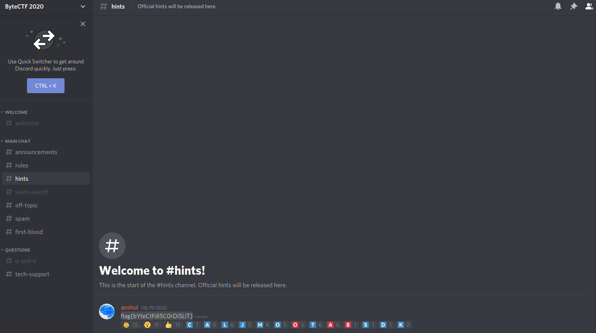

## wumpus rumpus

The main idea to find the flag is simple Discord Server joining and finding.

#### Step-1:
We are given Discord Server Link:

[https://discord.gg/YfKatbx](https://discord.gg/YfKatbx)

#### Step-2:
I joined the server and checked out channels to get the flag and got it here.

#### Step-3:
Finally, the flag becomes:
`flag{bYteCtFdi5C0rDi5LiT}`