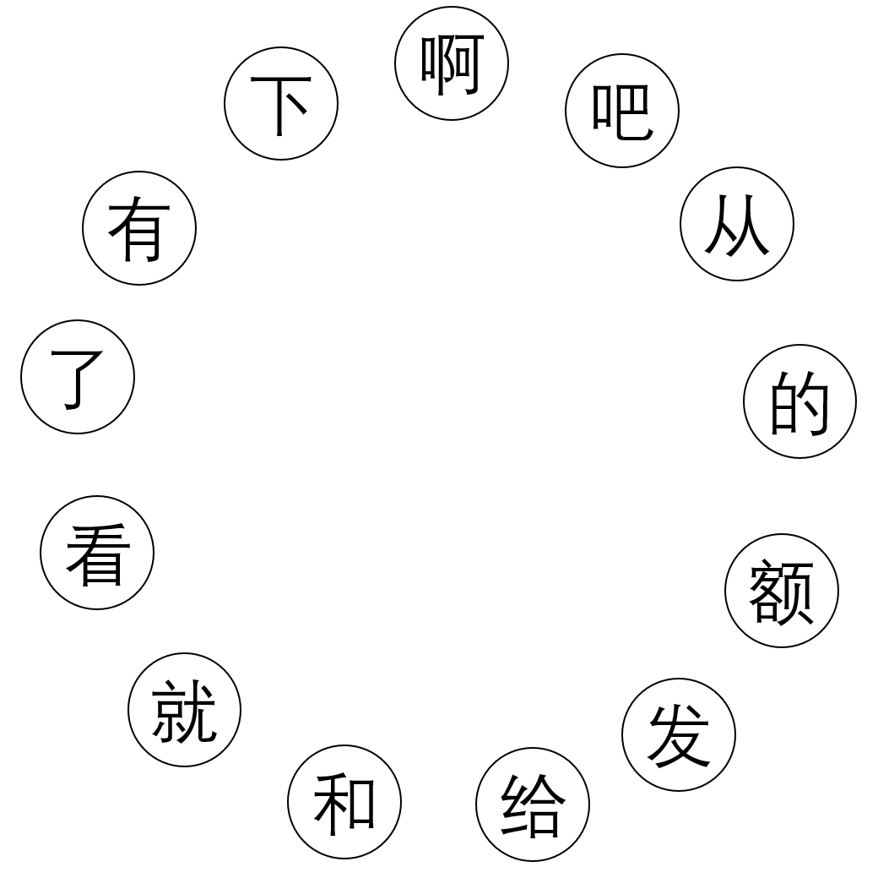
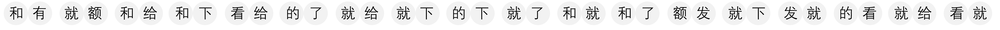
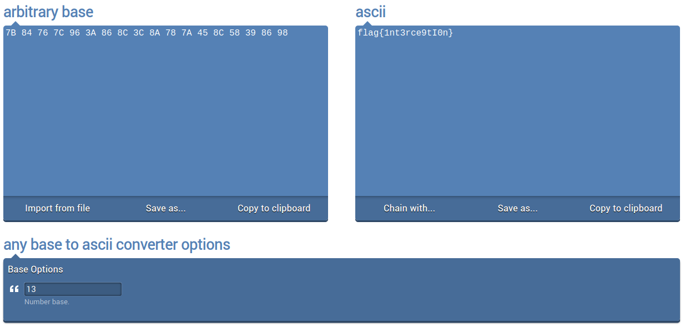

## All About That Base
The main idea to find the flag is simple logic.

#### Step-1:
After downloading the `allabouthatbase.png` image, it gives us idea of base.

The given cipher text is in `ciphertext.png`, so we look at that.

#### Step-2:
The `allabouthatbase.png` has the design like a clock, so I assigned them numbers from 1-13 and since its like a Base13, we have this sequence: `0123456789ABC`

#### Step-3:
If we decode the cipher text accordingly, we get:
`7B 84 76 7C 96 3A 86 8C 3C 8A 78 7A 45 8C 58 39 86 98`

#### Step-4:
Now, we just have to get this to ASCII text and I did it here: 
https://onlineasciitools.com/convert-arbitrary-base-to-ascii

#### Step-5:
Finally, the flag becomes:
`flag{1nt3rce9tI0n}`