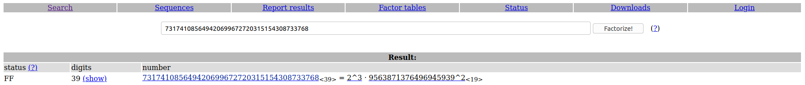

## Prime Dilemma

The main idea to find the flag is to just using RSA Encryption.

#### Step-1:
After downloading `primedilemma.txt`, I got this:

```
q > p
(p^3)*(q**2) = 731741085649420699672720315154308733768
e = 6969
encrypted text : 12541396840306196572
```

#### Step-2:
If you have some idea of [RSA](https://en.wikipedia.org/wiki/RSA_(cryptosystem)) functionality and its technicalities and its variable and we can crack this.

Given to us this unique variable:
p<sup>3</sup>.q<sup>2</sup> = 731741085649420699672720315154308733768

`c` is the cipher text. 
c = 12541396840306196572

`e` is directly given to us.
e = 6969

#### Step-3:
So, I tried to factorize the number given to get `p` & `q`. I used [FactorDB](http://factordb.com/) to do that.



#### Step-4:
So, I now we got `p = 2` & `q = 9563871376496945939`. Since `n = p.q`, 
`n = 19127742752993891878`

I wrote this script `prime.py` to get the flag.

```py
from Crypto.Util.number import inverse
import binascii

e = 6969
c = 12541396840306196572
n = 19127742752993891878

# From factordb

p = 2
q = 9563871376496945939

phi = (p-1) * (q-1)

d = inverse(e,phi)
m = pow(c,d,n)

hex_str = hex(m)[2:] # Removing '0x'
print(binascii.unhexlify(hex_str))
```

#### Step-5:
Executing this as `python3 prime.py`, we get this output:

```bash
b'tuchainz'
```

#### Step-6:
Finally, the flag becomes:
`flag{tuchainz}`