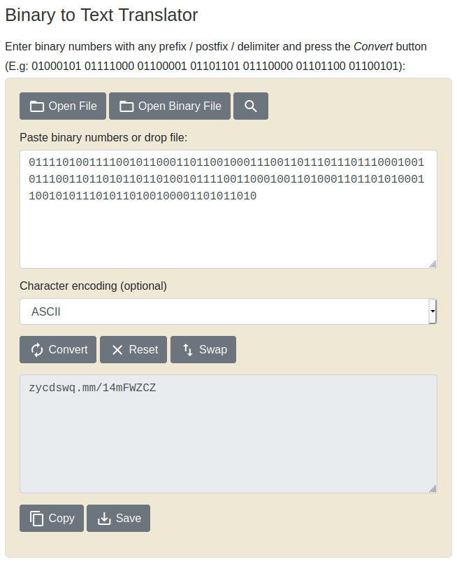
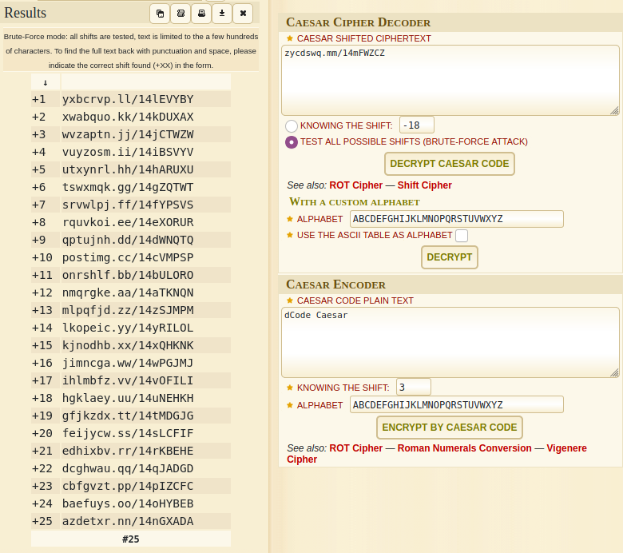
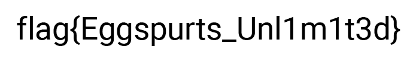

## sms

The main idea to find the flag is to just using Binary, Encryptions, etc.

#### Step-1:
After reading the description:

```
Luhsna promised to have a level as a tribute to the pr0 sms, so here it is.

smmmmsmssmmmmssmsmmsssmmsmmssmsssmmmssmmsmmmsmmmsmmmsssmssmsmmmssmmsmmsmsmmsmmsmssmsmmmmssmm
sssmssmmsmsssmmsmmsmsmsssmmssmsmsmmmsmsmmsmssmssssmmsmsmmsms

Find the flag.
```

#### Step-2:
I got the idea to replace s with 0 and m with 1 to get binary message.
So, I wrote this `sms.py` script to get the message first.

```py
r = "smmmmsmssmmmmssmsmmsssmmsmmssmsssmmmssmmsmmmsmmmsmmmsssmssmsmmmssmmsmmsmsmmsmmsmssmsmmmmssmmsssmssmmsmsssmmsmmsmsmsssmmssmsmsmmmsmsmmsmssmssssmmsmsmmsms"
r_new = r.replace('s','0').replace('m','1')
print("Message: " + r_new)
```
When this is executed as `python3 sms.py`, I got this output:

```bash
Message: 01111010011110010110001101100100011100110111011101110001001011100110110101101101001011110011000100110100011011010100011001010111010110100100001101011010
```

#### Step-3:
Lets find its ASCII equivalent [here](https://www.rapidtables.com/convert/number/binary-to-ascii.html).



Got this URL from there: zycdswq.mm/14mFWZCZ
It didn't work. But I thought this was encrypted.


#### Step-4:
So, I used [Caesar Cipher Decoder](https://www.dcode.fr/caesar-cipher) and brute forced all the keys to get possible legit URLs.



#### Step-5:
In all the results, the +10 padded result gave us nice URL:- https://postimg.cc/14cVMPSP
When I visited the URL, I got the flag there.



#### Step-6:
Finally, the flag becomes:
`flag{Eggspurts_Unl1m1t3d}`