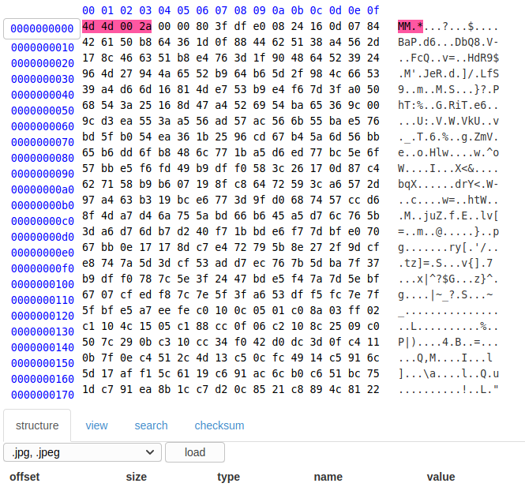

## Tiffy

The main idea to find the flag is to repair the corrupt `TIFF` file.

#### Step-1:
We are given `tiffy.tiff` and it is corrupted and cannot be viewed. In these cases, mostly the header or the EOI (End of Image) is changed or corrupted. We need to fix it with simple hex editor.

#### Step-2:
I opened an online [hex editor](https://www.onlinehexeditor.com/) and changed the header hex as to reference with 
https://en.wikipedia.org/wiki/List_of_file_signatures.

After we repair the corrupt, we get the flag.

#### Step-3:
Finally, the flag becomes:
`flag{My_H34d_My_B4CK_Th15_Lvl_W45_W4ck}`