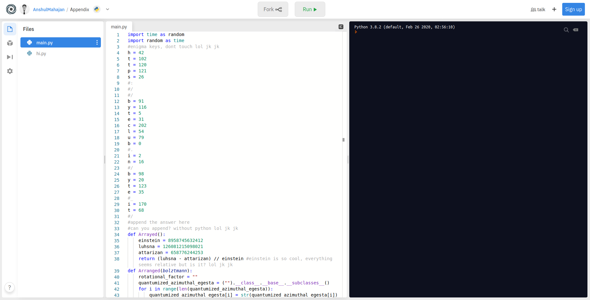
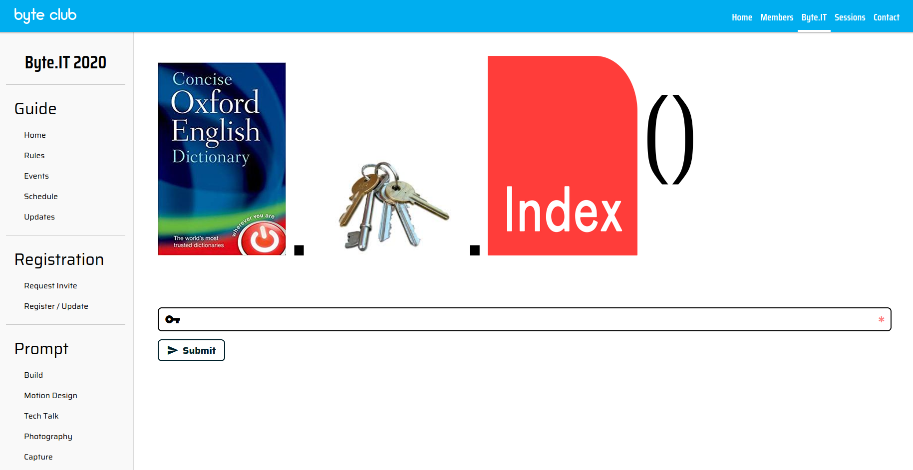

## Appendix
The main idea to find the flag is looking carefully in the code.

#### Step-1:
After visiting the URL given: [https://Appendix.anshulmahajan.repl.run](https://Appendix.anshulmahajan.repl.run), I was shell shocked to see that web page. It was humongous.

#### Step-2:
I had to take hint for Repl, Its new to me. After that I got this URL:
[https://repl.it/@AnshulMahajan/Appendix#main.py](https://repl.it/@AnshulMahajan/Appendix#main.py)



#### Step-3:
We are greeted with this code:

```py
import time as random
import random as time
#enigma keys, dont touch lol jk jk
h = 42
t = 102
t = 120
p = 121
s = 26
#:
#/
#/
b = 91
y = 116
t = 5
e = 31
c = 202
l = 54
u = 79
b = 0
#.
i = 2
n = 16
#/
b = 98
y = 20
t = 123
e = 35
#_
i = 170
t = 68
#/
#append the answer here
#can you append? without python lol jk jk
def Arrayed():
    einstein = 8958745632412
    luhsna = 126081215098021
    attarizan = 658776244253
    return (luhsna - attarizan) // einstein #einstein is so cool, everything seems relative but is it? lol jk jk
def Arranged(bolztmann):
    rotational_factor = ""
    quantumized_azimuthal_egesta = ("").__class__.__base__.__subclasses__()
    for i in range(len(quantumized_azimuthal_egesta)):
        quantumized_azimuthal_egesta[i] = str(quantumized_azimuthal_egesta[i])
    for i in range(48476440 // 12119110):
        if (i == 0):
            rotational_factor += quantumized_azimuthal_egesta[
                7658293832 // 7658293832][bolztmann]
        elif (i == 1):
            rotational_factor += quantumized_azimuthal_egesta[
                173086506913578 // 86543253456789][bolztmann]
        elif (i == 2):
            rotational_factor += quantumized_azimuthal_egesta[(
                (55787284761289 * 841) // 1617831258077381) + 3][bolztmann]
        elif (i == 3):
            rotational_factor += quantumized_azimuthal_egesta[
                (129961739795077 // (37**8)) + 3][bolztmann]
        elif (i == 4):
            rotational_factor += quantumized_azimuthal_egesta[
                (19858 // 8378329487) + 3][bolztmann]
        elif (i == 5):
            rotational_factor += quantumized_azimuthal_egesta[
                9827546517687280 // 9873829389][bolztmann]
        elif (i == 6):
            rotational_factor += quantumized_azimuthal_egesta[
                30303048265729 * 2992 // 242422333][bolztmann]
        else:
            rotational_factor += quantumized_azimuthal_egesta[
                43284736576376 // 1231232][bolztmann]
    return rotational_factor
def Inserted(Blaszczykowski, Pichichi):
    cabibbo = Blaszczykowski
    trefethen = Blaszczykowski
    eddington = list(Pichichi)
    eddington.extend(['{', '}'])
    feigenbaum = dict(zip(cabibbo, trefethen[::-1]))
    lmao = list(feigenbaum.values())
    lmaoo = list(feigenbaum.keys())
    lmao[b], lmao[y], lmao[u], lmao[e], lmao[i], lmao[t] = eddington
    feigenbaum = dict(zip(lmao, lmaoo)) #the answer lies here
def StartSort():
    directory_huge = ("").__class__.__base__.__subclasses__()
    directory_new = []
    for i in range(len(directory_huge)):
        directory_new.append(str(directory_huge[i]).replace("<class ", ""))
        directory_new[i] = directory_new[i].replace("\'", "")
        directory_new[i] = directory_new[i].replace(">", "")
    return directory_new
def StartRun(DIR):
    while True:
        print(time.choice(DIR), end='')
        random.sleep(0.01)
if __name__ == "__main__":
	print("Starting with the fun :")
	random.sleep(1)
	print("....")
	random.sleep(0.5)
	print("...")
	random.sleep(0.2)
	print("..")
	random.sleep(0.1)
	print(".")
	Lushnatidaa_thesis = StartSort()
	Avogadro_constant = Arrayed()
	Mascheroni_constant = Arranged(Avogadro_constant)
	Champernowne_constant = Inserted(Lushnatidaa_thesis, Mascheroni_constant)
	StartRun(Lushnatidaa_thesis)

#am i really kidding? or am i not kidding? it is up to you to decide :)
```

According to description, we had concentrate on code. So I looked at comments and found an interesting function `Inserted()`. 
It mapped `Eddington`'s value in the `Feigenbaum` dict pointer. On mapping values of keys `f`, `l`, `a`, `g`, `{`, `}` from the dictionary, I got new URL for the message. get a new URL

```py
def Inserted(Blaszczykowski, Pichichi):
    cabibbo = Blaszczykowski
    trefethen = Blaszczykowski
    eddington = list(Pichichi)
    eddington.extend(['{', '}'])
    feigenbaum = dict(zip(cabibbo, trefethen[::-1]))
    lmao = list(feigenbaum.values())
    lmaoo = list(feigenbaum.keys())
    lmao[b], lmao[y], lmao[u], lmao[e], lmao[i], lmao[t] = eddington
    feigenbaum = dict(zip(lmao, lmaoo)) #the answer lies here
```

#### Step-4:
After decoding, we get this URL: 
https://byteclub.in/byte_it/_frozen_importlib_external.FileFinderodict_iteratorzipcode_collections._tuplegetterkeys

We are greeted with this:



#### Step-5:
I got that for key, we will have to index the FLAG. It gives us `9820793517068`. If we add that, we get the flag.


#### Step-6:
Finally, the flag becomes:
`flag{N07rEvN0RcRYp70_jU57519h71N'}`