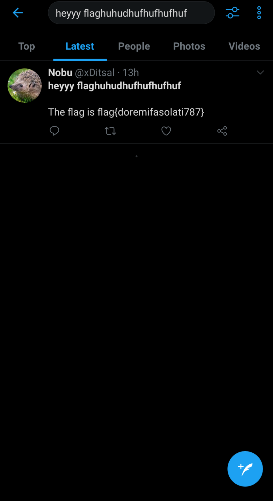

## Chirrup
The main idea to find the flag is simple usage of OSINT.

#### Step-1:
After reading the description of the challenge:

```
Nobu fell asleep while he was sending me the flag. This is all I received

heyyy flaghuhudhufhufhufhuf

I have this feeling that the flag is there, somewhere on the internet. Can you find it for
me?
```

#### Step-2:
The challenge name gives us an idea of Twitter. So, I searched `heyyy flaghuhudhufhufhufhuf` on Twitter and got flag there.



#### Step-3:
Finally, the flag becomes:
`flag{doremifasolati787}`