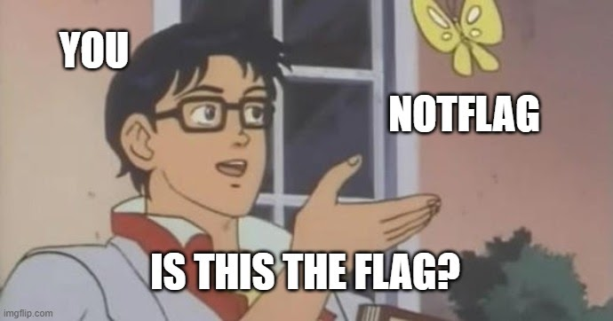
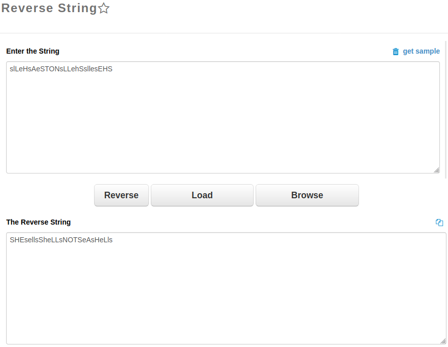

## Is this is the flag?
The main idea to get the flag is simple `cat` command.

#### Step-1:
The description given:
```
Alternate. Reverse.
```

Also this meme template should give us a lot of hint.



After I downloaded `shells.sh`, I tried to change permissions and run it by `./shells.sh`. But I got weird output.

#### Step-2:
I got this:

```
s
g
l
a
L
l
e
f
H
e
s
k
A
a
e
f
S
y
T
l
O
e
N
t
s
u
L
l
L
o
e
s
h
b
S
a
s
e
l
t
l
u
e
l
s
o
E
s
H
b
S
a
```

#### Step-3:
So, I just used `cat shells.sh` to understand what's going on here.

I got this output:

```bash
NotNotFlag=(s l L e H s A e S T O N s L L e h S s l l e s E H S)
NotFlag=(g a l f e k a f y l e t u l o s b a e t u l o s b a)

for i in ${!NotNotFlag[@]};do
	echo ${NotNotFlag[$i]};
	echo ${NotFlag[$i]};
	sleep 0.2
done
```

Clearly, our interest was in `NotNotFlag` string. The meme above also should give us that idea.
Now only we had to reverse it.


#### Step-4:
Reversed the string [here](https://codebeautify.org/reverse-string).



#### Step-5:
Finally, the flag becomes:
`flag{SHEsellsSheLLsNOTSeAsHeLls}`