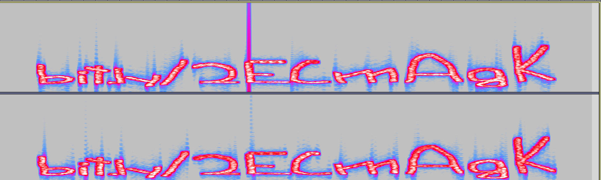

## Jadoo
The main idea to find the flag is using Stego Techniques.

#### Step-1:
After downloading `dhoop.wav`, it gave me idea that it has relation to Spectogram View.

#### Step-2:
So, I opened it in Audacity, and viewed it in Spectogram View. If you are unaware of it, a simple search on Google will guide through it.

#### Step-3:
This gave us a link: bit.ly/2ECmAgk. Its a Google Drive Link. We are given a doc with a mixture of Cipher in it.

Cipher: `QdoyQ3kLrXclr2clQ09dIdoyQ3EAt0omu2kcvLIgQdQgP3MjuY0=`

#### Step-4:
It is clearly Base64, it was multiply encrypted with Ceaser Cipher. So brute forcing that link to get all possible Base64 encryptions, we get:

Base64 enc: `ZmxhZ3tUaGlua2luZ09mRmxhZ3NJc0xvd2tleURpZmZpY3VsdH0=` (At padding 17).

Decoding it, gives us the flag.

#### Step-5:
Finally, the flag becomes:
`flag{ThinkingOfFlagsIsLowkeyDifficult}`