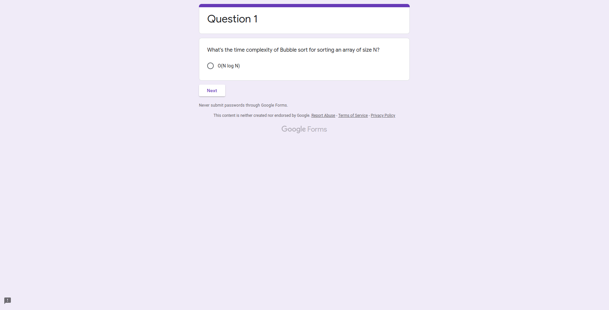
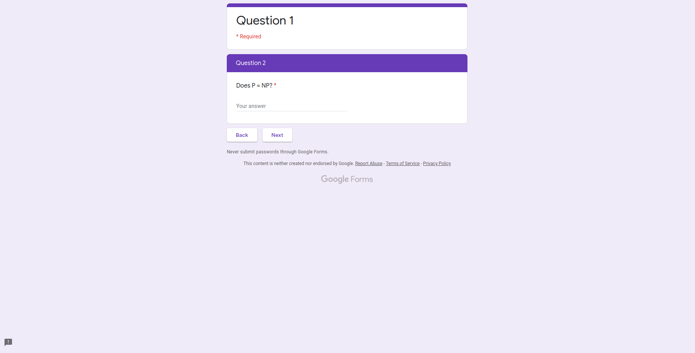
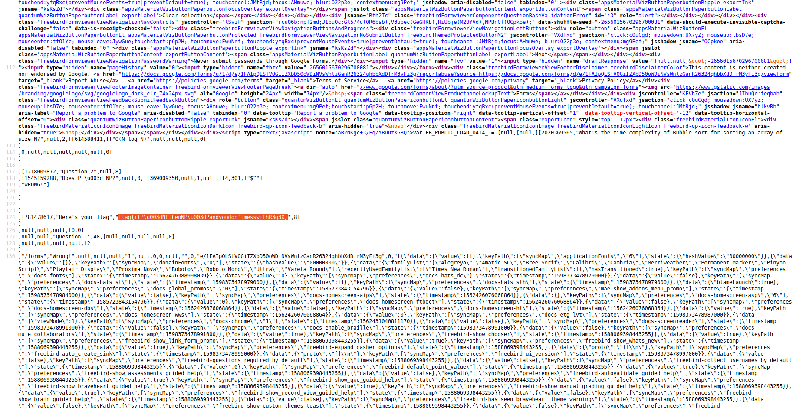

## Wrong?
The main idea to find the flag is simple Inspecting Web Page.

#### Step-1:
The description of the challenge is given as:

Alongwith that we are given [https://forms.gle/xKctfcSwZjsMi2H79](https://forms.gle/xKctfcSwZjsMi2H79).

#### Step-2:
So, I tried to open the Form link to get this:

#### Step-3:
After repetitive incorrect answers, I tried to view the Page Source and there I got this:

#### Step-4:
`flag{ifP\u003dNPthenNP\u003dPandyoudon'tmesswithR3g3X}`. Clearly, `\u003d` has to be `=`.

#### Step-5:
Finally, the flag becomes:
`flag{ifP=NPthenNP=Pandyoudon'tmesswithR3g3X}`