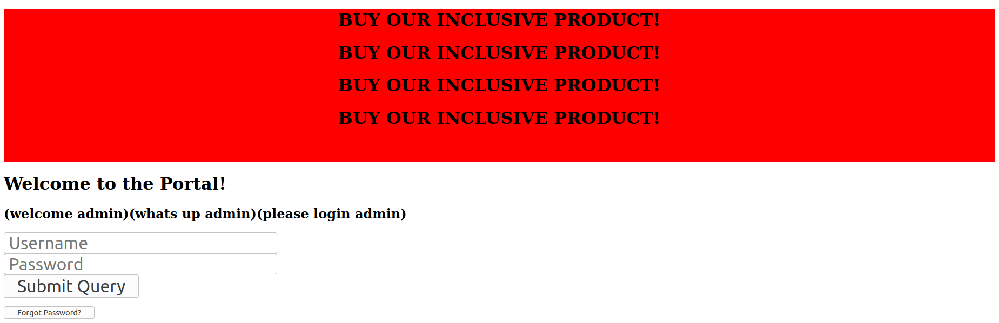
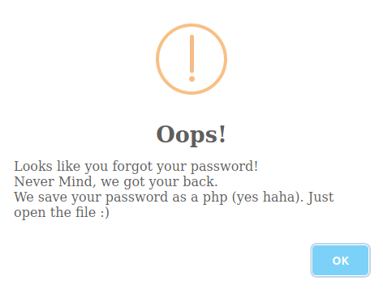
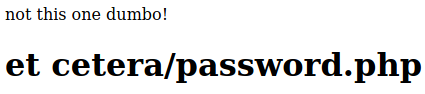
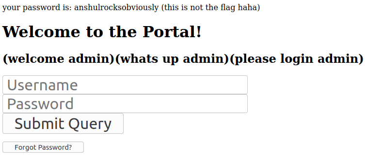
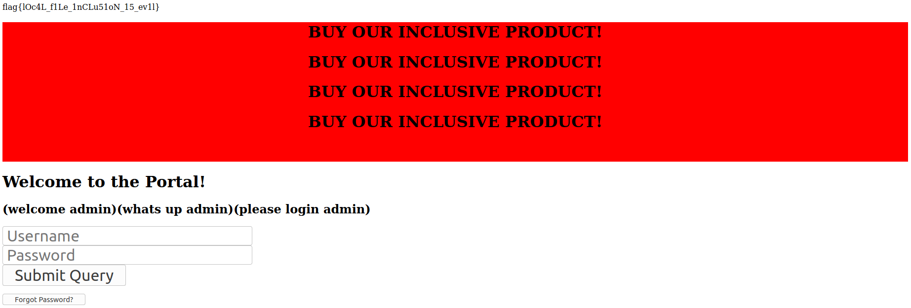

## Admin Portal
The main idea to find the flag is exploitation from Local File Inclusion (LFI).

#### Step-1:
We are given this link: https://monster-bytectf.herokuapp.com/ or https://monster-bytectf.herokuapp.com/index.php?

#### Step-2:
The trying of `/index.php` at the end of the URL, gave me idea of LFI.



So, I tried to use some random credentials, where I encountered this error.



#### Step-3:
So, next I tried https://monster-bytectf.herokuapp.com/password.php . Damn Got this:



So we surely change it to LFI as follows:
http://monster-bytectf.herokuapp.com/index.php?file=etc/password.php



#### Step-4:
We got the password there. So I used this credentials to login.

```
username: admin
password: anshulrocksobviously
```
Voila, I had the flag there.



#### Step-5:
Finally, the flag becomes:
`flag{lOc4L_f1Le_1nCLu51oN_15_ev1l}`