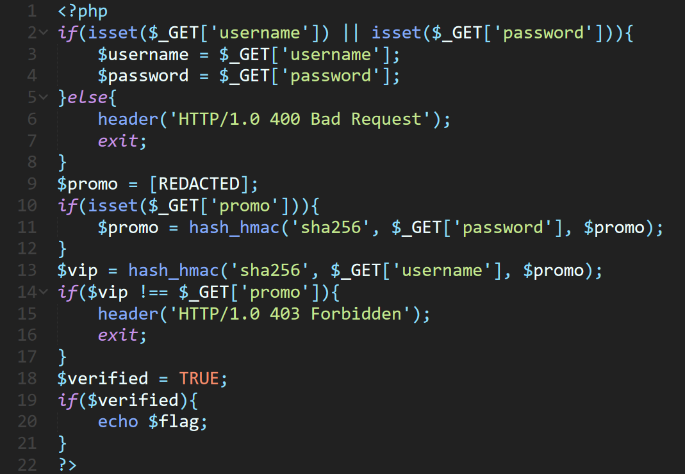
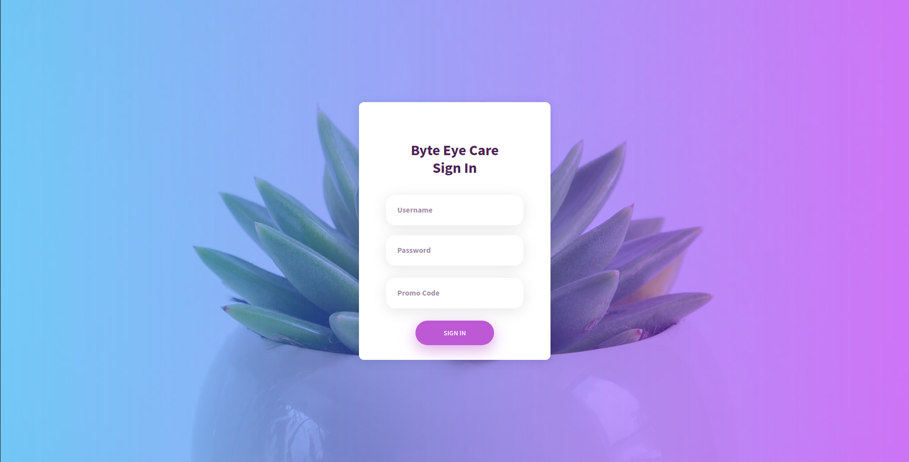
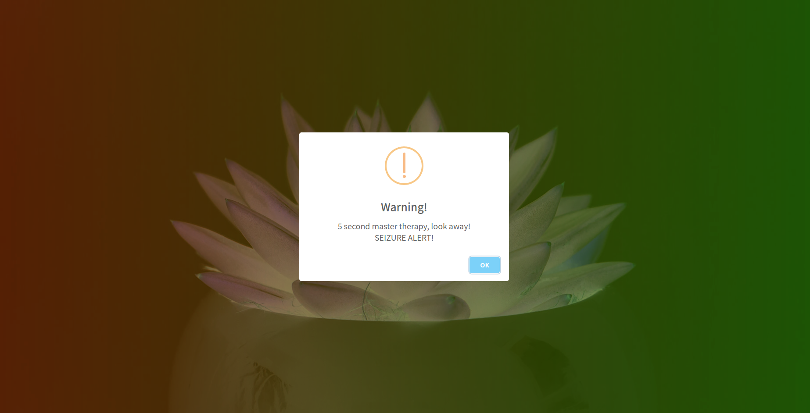

## Eyecare v2
The main idea to find the flag is PHP vulnerability exploitation of NULL string.

#### Step-1:
We are given this link: http://eyecare.byethost32.com/v2

Also this image `eyecarev2.png`:



#### Step-2:
After I visited the website, we are greeted with:



After some futile tries of accessing, I got the PHP vuln there and get to know that Promo Code is SHA256 hash of hash is just hash of the password or username with key value set to null.

The following credentials work:

```c
Username: o
Password: string (any string)
Promo Code: 49a8f62406c86b65a6758790bc1fd124cc0be320539ee35aa6838edc1cf3b4df
```
The same can be accessed [here](http://eyecare.byethost32.com/v2/verify.php?username=o&password[]=ok&promo=49a8f62406c86b65a6758790bc1fd124cc0be320539ee35aa6838edc1cf3b4df).





#### Step-3:
Finally, the flag becomes:
`flag{3y3c4r3bu7wi7hh45h35}`
