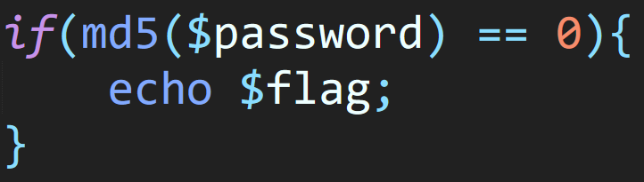
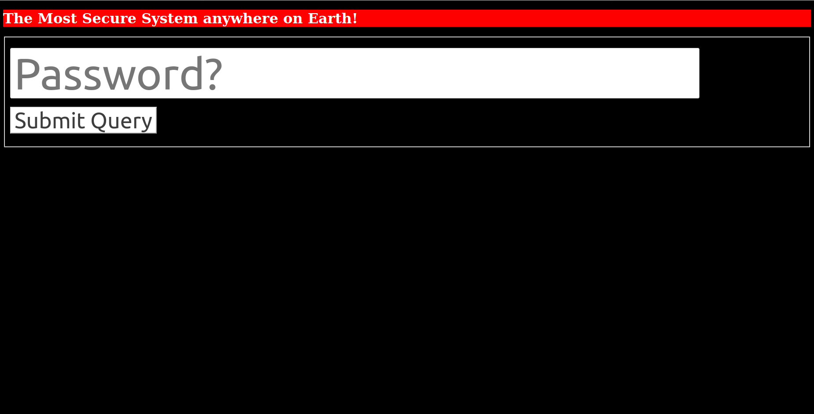
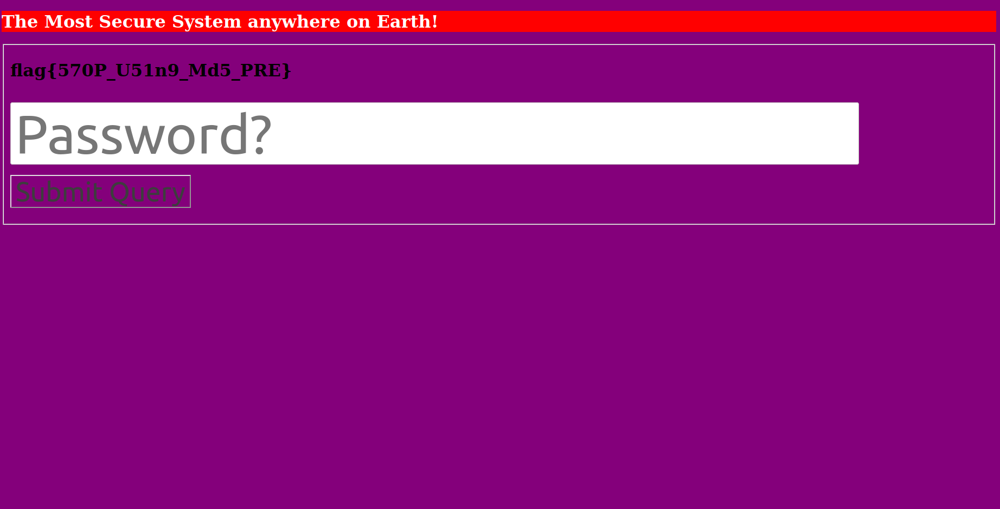

## Eyecare
The main idea to get the flag is simple attention to the description of the challenge.

#### Step-1:
The given description is as follows:

```
We are Byte Eye-Care and we care about your eyes. We have built this new eye care platform 
that we are giving out for free. All you have to do is guess the password and experience 
therapy like never before. Our clients are mostly vegetable sellers but we love you too.
```

This is the link given to us: [http://eyecare.byethost32.com/](http://eyecare.byethost32.com/)
along with the image `eyes.PNG`



#### Step-2:
I visited the website to get this:



I tried the passwords: `vegetable`, `vegetables`, `Vegetable`, `Vegetables`. Luckily `Vegetable` worked and I got the flag.

#### Step-3:
The page:




#### Step-4:
Finally, the flag becomes:
`flag{570P_U51n9_Md5_PRE}`