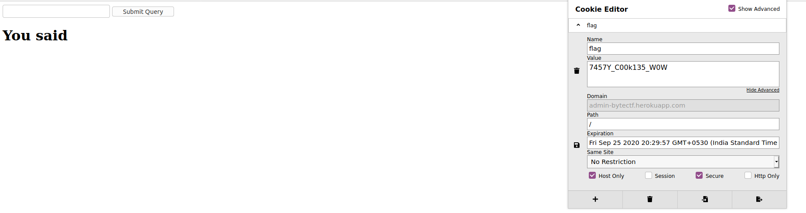

## Monster
The main idea to find the flag is simple cookie management.

#### Step-1:
After visiting the given link: [http://admin-bytectf.herokuapp.com/](http://admin-bytectf.herokuapp.com/)

In the description, there is a mention of sweet food.

#### Step-2:
The web page given:

So, I looked out for cookies and I got the flag there.
<h5>PS: I use Cookie Editor extension by Firefox</h5>

#### Step-3:
Finally, the flag becomes:
`flag{7457Y_C00k135_W0W}`